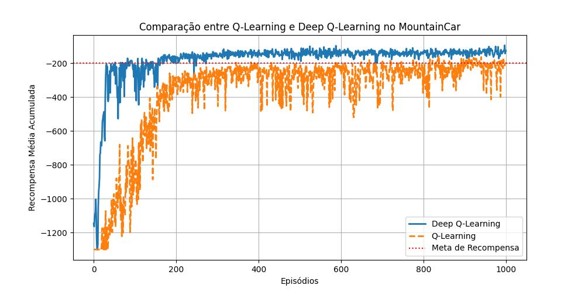

[](https://classroom.github.com/a/3cFWPdqG)


# Implementação de Q-Learning e Deep Q-Learning para MountainCar

### Aluno: Pedro Vaz de Moraes Pertusi

## Descrição
Este projeto implementa e compara as abordagens de Q-Learning e Deep Q-Learning para resolver o ambiente **MountainCar** do OpenAI Gym. O objetivo é avaliar o desempenho dos dois algoritmos em termos de aprendizado e inferência.

## Estrutura do Projeto
- **Q-Learning:** Implementação baseada em tabela Q-table. **/qtable:** Diretório onde as Q-tables treinadas são armazenadas

- **Deep Q-Learning:** Rede neural treinada para estimar a função de valor Q. **/models:** Diretório onde os pesos do Deep Q-Learning são armazenados.

- **Comparação:** Visualização dos resultados através de curvas de aprendizado e inferência.


## Hiperparâmetros do Deep Q-Learning
```python
# Hiperparâmetros
gamma = 0.99
epsilon = 1.0
epsilon_min = 0.01
epsilon_dec = 0.995
episodes = 1000
batch_size = 64
memory_size = 10000
max_steps = 1300
alpha = 0.001
```

## Resultados
### Q-Learning


### Q-Learning (Acumulado | N = 5)


### Deep Q-Learning


### Deep Q-Learning (Acumulado | N = 5)


### Comparação


### Desempenho de Ambos os Agentes sem Treinamento
